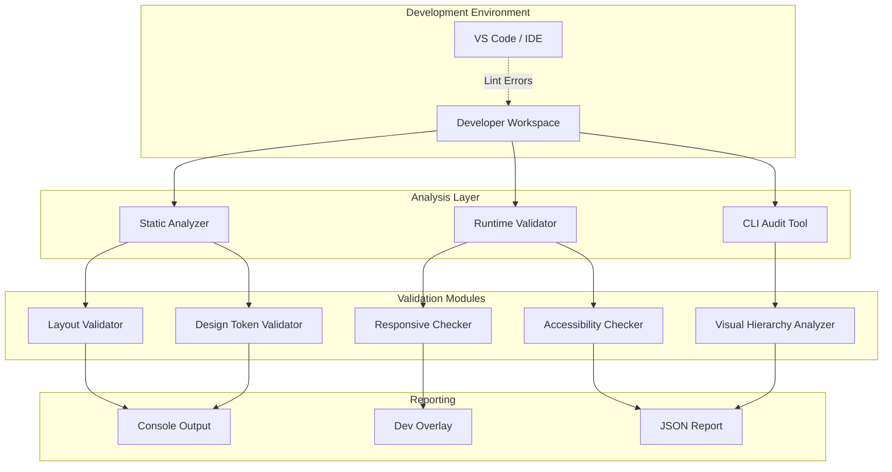

# Design Document: UI Design Improvements

## Overview

This design document outlines the architecture and implementation strategy for a comprehensive UI analysis and improvement system for the Next.js workspace platform. The system will automatically detect layout issues, validate responsive behavior, ensure accessibility compliance, and maintain design system consistency across the application.

The solution consists of several interconnected components:

- **UI Analyzer**: Static analysis tool that scans React components for layout issues, spacing inconsistencies, and design token violations
- **Responsive Validator**: Runtime testing framework that validates layout behavior across viewport breakpoints
- **Accessibility Checker**: Automated accessibility audit system using axe-core and custom validation rules
- **Visual Hierarchy Optimizer**: Analysis tool that evaluates contrast ratios, heading structure, and visual prominence
- **Design System Validator**: Token usage checker that ensures consistent application of CSS custom properties

The system will be implemented as a combination of:
1. Build-time static analysis tools (ESLint plugins, custom AST parsers)
2. Runtime validation utilities (browser-based layout testing)
3. CLI commands for on-demand audits
4. Development-mode overlays for real-time feedback

### Key Design Decisions

**Static Analysis Over Runtime-Only**: We prioritize catching issues during development through static analysis rather than only at runtime. This provides faster feedback and prevents issues from reaching production.

**Incremental Adoption**: The system will report issues with severity levels (critical, moderate, minor) allowing teams to address problems incrementally rather than requiring all fixes upfront.

**Framework Integration**: Built as Next.js-native tooling that understands the framework's conventions (App Router, Server Components, Client Components) rather than generic React tooling.

**Design Token Enforcement**: Leverages the existing CSS custom property system in globals.css as the single source of truth for design values.

## Architecture

### System Components



### Component Interaction Flow

1. **Development Mode**: When `npm run dev` starts, the Static Analyzer runs alongside Next.js compilation
2. **File Watch**: On file save, the analyzer re-scans changed components
3. **Runtime Validation**: When pages load in the browser, Runtime Validator executes checks
4. **Issue Detection**: Validators identify problems and categorize by severity
5. **Reporting**: Issues are displayed in console, dev overlay, or exported as JSON

### Technology Stack

- **Static Analysis**: TypeScript Compiler API, ESLint custom rules, PostCSS plugins
- **Runtime Validation**: Playwright for cross-viewport testing, ResizeObserver API
- **Accessibility**: axe-core library, custom WCAG validation rules
- **Reporting**: Terminal UI with chalk, browser overlay with React

## Components and Interfaces

### UI Analyzer

The core static analysis engine that scans component files for layout issues.

```typescript
interface UIAnalyzer {
  scanComponent(filePath: string): LayoutIssue[];
  scanDirectory(dirPath: string): AnalysisReport;
  watchMode(callback: (issues: LayoutIssue[]) => void): void;
}

interface LayoutIssue {
  type: IssueType;
  severity: 'critical' | 'moderate' | 'minor';
  filePath: string;
  lineNumber: number;
  columnNumber: number;
  message: string;
  suggestion?: string;
  autoFixable: boolean;
}

type IssueType =
  | 'overflow'
  | 'misalignment'
  | 'spacing-inconsistency'
  | 'z-index-conflict'
  | 'hardcoded-color'
  | 'missing-responsive'
  | 'touch-target-small'
  | 'contrast-insufficient';
```

**Implementation Approach**:
- Parse TSX files using TypeScript Compiler API
- Extract JSX elements and their className attributes
- Analyze Tailwind classes for layout patterns
- Check for hardcoded style values in style props
- Validate spacing values against design system scale
- Detect missing responsive variants (sm:, md:, lg:, xl:)

### Responsive Validator

Runtime testing framework that validates layout behavior across breakpoints.

```typescript
interface ResponsiveValidator {
  testViewport(url: string, width: number, height: number): Promise<ViewportReport>;
  testAllBreakpoints(url: string): Promise<ResponsiveReport>;
  checkHorizontalScroll(page: Page): Promise<boolean>;
  checkTouchTargets(page: Page): Promise<TouchTargetIssue[]>;
}

interface ViewportReport {
  width: number;
  height: number;
  hasHorizontalScroll: boolean;
  touchTargetIssues: TouchTargetIssue[];
  layoutShifts: LayoutShift[];
  screenshot?: Buffer;
}

interface TouchTargetIssue {
  selector: string;
  width: number;
  height: number;
  minimumRequired: { width: number; height: number };
}

interface ResponsiveReport {
  url: string;
  breakpoints: {
    mobile: ViewportReport;    // 375px
    tablet: ViewportReport;    // 768px
    desktop: ViewportReport;   // 1280px
    wide: ViewportReport;      // 1920px
  };
  issues: LayoutIssue[];
}
```

**Implementation Approach**:
- Use Playwright to launch browser instances
- Navigate to each page route
- Resize viewport to standard breakpoints (640px, 768px, 1024px, 1280px)
- Query all interactive elements (buttons, links, inputs)
- Measure bounding boxes using `element.getBoundingClientRect()`
- Check `document.documentElement.scrollWidth > window.innerWidth` for horizontal scroll
- Capture screenshots for visual regression testing

### Accessibility Checker

Automated accessibility audit system using axe-core and custom rules.

```typescript
interface AccessibilityChecker {
  auditPage(url: string): Promise<A11yReport>;
  checkKeyboardNav(page: Page): Promise<KeyboardIssue[]>;
  checkFocusIndicators(page: Page): Promise<FocusIssue[]>;
  checkColorContrast(page: Page): Promise<ContrastIssue[]>;
  checkReducedMotion(): Promise<MotionIssue[]>;
}

interface A11yReport {
  url: string;
  violations: A11yViolation[];
  passes: A11yPass[];
  incomplete: A11yIncomplete[];
  wcagLevel: 'A' | 'AA' | 'AAA';
  score: number; // 0-100
}

interface A11yViolation {
  id: string;
  impact: 'critical' | 'serious' | 'moderate' | 'minor';
  description: string;
  help: string;
  helpUrl: string;
  nodes: ViolationNode[];
}

interface ViolationNode {
  html: string;
  target: string[];
  failureSummary: string;
}

interface KeyboardIssue {
  element: string;
  issue: 'not-focusable' | 'no-tab-index' | 'focus-trap';
  recommendation: string;
}

interface FocusIssue {
  element: string;
  currentOutline: string;
  requiredOutline: string; // "2px solid with 2px offset"
}

interface ContrastIssue {
  element: string;
  foreground: string;
  background: string;
  ratio: number;
  requiredRatio: number;
  wcagLevel: 'AA' | 'AAA';
}
```

**Implementation Approach**:
- Integrate axe-core library for WCAG validation
- Run axe.run() on each page to get violation reports
- Custom keyboard navigation testing:
  - Tab through all interactive elements
  - Verify focus order matches visual order
  - Check that focus is visible (outline present)
- Contrast checking:
  - Extract computed styles for text elements
  - Calculate contrast ratio using WCAG formula
  - Compare against 4.5:1 (normal text) and 3:1 (large text) thresholds
- Reduced motion:
  - Check for `@media (prefers-reduced-motion: reduce)` in CSS
  - Verify animations respect the media query

### Visual Hierarchy Optimizer

Analysis tool that evaluates heading structure, contrast, and visual prominence.

```typescript
interface VisualHierarchyOptimizer {
  analyzeHeadingStructure(html: string): HeadingReport;
  analyzeButtonHierarchy(page: Page): ButtonHierarchyReport;
  analyzeSectionSpacing(page: Page): SpacingReport;
  analyzeAccentUsage(css: string): AccentUsageReport;
}

interface HeadingReport {
  headings: HeadingNode[];
  issues: HeadingIssue[];
  structure: 'valid' | 'invalid';
}

interface HeadingNode {
  level: 1 | 2 | 3 | 4 | 5 | 6;
  text: string;
  fontSize: string;
  fontWeight: string;
  lineHeight: string;
}

interface HeadingIssue {
  type: 'skipped-level' | 'inconsistent-size' | 'multiple-h1';
  heading: HeadingNode;
  message: string;
}

interface ButtonHierarchyReport {
  primaryButtons: ButtonInfo[];
  secondaryButtons: ButtonInfo[];
  issues: ButtonIssue[];
}

interface ButtonInfo {
  text: string;
  className: string;
  visualWeight: number; // calculated score
}

interface ButtonIssue {
  type: 'ambiguous-hierarchy' | 'too-many-primary';
  message: string;
}

interface SpacingReport {
  sections: SectionInfo[];
  averageGap: number;
  inconsistencies: SpacingIssue[];
}

interface SectionInfo {
  selector: string;
  marginTop: number;
  marginBottom: number;
  paddingTop: number;
  paddingBottom: number;
}

interface SpacingIssue {
  sections: [string, string];
  expectedGap: number;
  actualGap: number;
  deviation: number;
}
```

**Implementation Approach**:
- Parse HTML to extract heading elements (h1-h6)
- Verify heading levels don't skip (e.g., h1 → h3 without h2)
- Check that only one h1 exists per page
- Measure font sizes and verify h1 > h2 > h3 hierarchy
- Identify buttons by className (button-primary, button-secondary, button-ghost)
- Calculate visual weight based on background color, border, padding
- Measure spacing between section elements
- Flag deviations from consistent spacing patterns

### Design System Validator

Token usage checker that ensures consistent application of CSS custom properties.

```typescript
interface DesignSystemValidator {
  validateColors(css: string, tsx: string): ColorViolation[];
  validateSpacing(tsx: string): SpacingViolation[];
  validateBorderRadius(tsx: string): RadiusViolation[];
  validateFonts(tsx: string): FontViolation[];
  generateReport(): DesignSystemReport;
}

interface ColorViolation {
  type: 'hardcoded-hex' | 'hardcoded-rgb' | 'non-token-var';
  value: string;
  location: CodeLocation;
  suggestedToken: string;
}

interface SpacingViolation {
  type: 'arbitrary-value' | 'non-scale-value';
  value: string;
  location: CodeLocation;
  suggestedValue: string;
}

interface RadiusViolation {
  type: 'hardcoded-radius' | 'non-token-radius';
  value: string;
  location: CodeLocation;
  suggestedToken: 'var(--radius-sm)' | 'var(--radius-md)' | 'var(--radius-lg)';
}

interface FontViolation {
  type: 'hardcoded-font' | 'non-token-font';
  value: string;
  location: CodeLocation;
  suggestedToken: 'var(--font-sans)' | 'var(--font-mono)' | 'var(--font-display)';
}

interface CodeLocation {
  filePath: string;
  lineNumber: number;
  columnNumber: number;
  snippet: string;
}

interface DesignSystemReport {
  totalViolations: number;
  colorViolations: ColorViolation[];
  spacingViolations: SpacingViolation[];
  radiusViolations: RadiusViolation[];
  fontViolations: FontViolation[];
  complianceScore: number; // 0-100
}
```

**Implementation Approach**:
- Parse CSS and TSX files using PostCSS and TypeScript Compiler API
- Search for hardcoded color values (hex, rgb, rgba, hsl)
- Check className attributes for arbitrary Tailwind values (e.g., `p-[13px]`)
- Validate spacing values against design scale: 0.5rem, 0.75rem, 1rem, 1.5rem, 2rem
- Check border-radius values against --radius-sm (10px), --radius-md (16px), --radius-lg (24px)
- Verify font-family declarations use CSS custom properties
- Generate suggestions by mapping detected values to nearest design tokens

## Data Models

### Configuration

```typescript
interface UIAnalysisConfig {
  enabled: boolean;
  mode: 'development' | 'ci' | 'production';
  rules: RuleConfig;
  breakpoints: Breakpoint[];
  reporting: ReportingConfig;
}

interface RuleConfig {
  layout: {
    checkOverflow: boolean;
    checkAlignment: boolean;
    checkSpacing: boolean;
    checkZIndex: boolean;
  };
  responsive: {
    minTouchTargetSize: { width: number; height: number };
    breakpoints: number[];
    allowHorizontalScroll: boolean;
  };
  accessibility: {
    wcagLevel: 'A' | 'AA' | 'AAA';
    checkKeyboard: boolean;
    checkFocus: boolean;
    checkContrast: boolean;
    checkReducedMotion: boolean;
  };
  designSystem: {
    enforceTokens: boolean;
    allowedArbitraryValues: string[];
    strictMode: boolean;
  };
}

interface Breakpoint {
  name: string;
  width: number;
  height: number;
}

interface ReportingConfig {
  console: boolean;
  overlay: boolean;
  json: boolean;
  outputPath: string;
  minSeverity: 'critical' | 'moderate' | 'minor';
}
```

### Analysis Results

```typescript
interface AnalysisReport {
  timestamp: string;
  duration: number; // milliseconds
  summary: AnalysisSummary;
  issues: LayoutIssue[];
  responsiveReport?: ResponsiveReport;
  a11yReport?: A11yReport;
  designSystemReport?: DesignSystemReport;
}

interface AnalysisSummary {
  totalIssues: number;
  criticalIssues: number;
  moderateIssues: number;
  minorIssues: number;
  filesScanned: number;
  pagesAudited: number;
  complianceScore: number; // 0-100
}
```

## Technical Approach for Each Requirement

### Requirement 1: Layout Issue Detection

**Approach**: Build an ESLint plugin that analyzes JSX for common layout anti-patterns.

**Detection Rules**:
- **Overflow**: Check for `overflow-hidden` without explicit width/height constraints
- **Misalignment**: Detect flex containers without alignment classes (items-center, items-start)
- **Spacing**: Flag arbitrary spacing values like `p-[13px]` that don't match design scale
- **Z-index**: Track z-index usage across components and flag conflicts

**Severity Assignment**:
- Critical: Breaks layout on mobile, causes horizontal scroll
- Moderate: Inconsistent spacing, missing responsive variants
- Minor: Non-standard values that work but don't follow design system

### Requirement 2: Responsive Design Validation

**Approach**: Use Playwright to test pages at standard breakpoints (640px, 768px, 1024px, 1280px).

**Test Sequence**:
1. Launch headless browser
2. Navigate to page
3. For each breakpoint:
   - Resize viewport
   - Wait for layout stabilization
   - Check `document.documentElement.scrollWidth > window.innerWidth`
   - Query all buttons/links and measure dimensions
   - Verify minimum 44x44px touch targets
   - Calculate text size and check readability (minimum 14px on mobile)

**Mobile-Specific Checks**:
- Single-column layout verification (no multi-column grids)
- Font size >= 14px for body text
- Touch targets >= 44x44px
- Horizontal padding reduced to 1rem

### Requirement 3: Visual Hierarchy Enhancement

**Approach**: Parse rendered HTML and analyze computed styles for hierarchy patterns.

**Heading Analysis**:
- Extract all h1-h6 elements
- Verify single h1 per page
- Check heading levels don't skip
- Measure font sizes and verify descending scale

**Button Analysis**:
- Identify primary vs secondary buttons by className
- Count primary buttons per section (should be 1-2 max)
- Verify visual distinction (different background/border)

**Contrast Analysis**:
- Extract foreground and background colors
- Calculate contrast ratio: `(L1 + 0.05) / (L2 + 0.05)` where L is relative luminance
- Compare against WCAG AA thresholds (4.5:1 normal, 3:1 large)

**Accent Color Consistency**:
- Search for uses of #8aa2ff or var(--color-accent)
- Verify accent color only used for interactive elements
- Flag decorative uses that should use text-muted instead

### Requirement 4: Design System Consistency

**Approach**: Static analysis of CSS and TSX files to enforce design token usage.

**Color Validation**:
- Regex search for hex colors: `/#[0-9a-fA-F]{3,6}/`
- Regex search for rgb/rgba: `/rgba?\([^)]+\)/`
- Check if value matches a design token
- Suggest nearest token (e.g., `#8aa2ff` → `var(--color-accent)`)

**Spacing Validation**:
- Parse Tailwind classes for spacing utilities (p-, m-, gap-)
- Extract arbitrary values: `/\[[\d.]+(?:px|rem)\]/`
- Check against design scale: [0.5, 0.75, 1, 1.25, 1.5, 2, 2.5, 3] rem
- Flag values outside scale

**Border Radius Validation**:
- Search for `rounded-` classes with arbitrary values
- Check against --radius-sm (10px), --radius-md (16px), --radius-lg (24px)
- Suggest appropriate token

**Font Validation**:
- Check font-family declarations
- Verify usage of var(--font-sans), var(--font-mono), var(--font-display)
- Flag hardcoded font names

### Requirement 5: Accessibility Compliance

**Approach**: Integrate axe-core for automated WCAG testing plus custom checks.

**Keyboard Navigation**:
- Programmatically tab through page
- Track focus order using `document.activeElement`
- Verify all interactive elements receive focus
- Check for focus traps (focus can't escape modal)

**Focus Indicators**:
- Query focused element styles
- Verify outline: `2px solid` with `2px offset`
- Check outline color has sufficient contrast

**Alt Text**:
- Query all `` elements
- Verify `alt` attribute exists and is non-empty
- Flag decorative images without `alt=""` or `role="presentation"`

**Form Labels**:
- Query all `<input>`, `<textarea>`, `<select>` elements
- Verify associated `<label>` via `for` attribute or wrapping
- Check for `aria-label` or `aria-labelledby` as alternatives

**Color Dependency**:
- Identify status indicators (success, warning, error)
- Verify text or icon accompanies color
- Flag color-only indicators

**Reduced Motion**:
- Parse CSS for animation/transition declarations
- Verify `@media (prefers-reduced-motion: reduce)` wrapper exists
- Check that animations are disabled or reduced in scope

### Requirement 6: Performance Optimization

**Approach**: Use Lighthouse API and custom performance metrics.

**Above-the-Fold Rendering**:
- Measure First Contentful Paint (FCP)
- Target: FCP < 1.5s
- Use Lighthouse programmatic API
- Test on simulated 3G connection

**Animation Performance**:
- Monitor frame rate during animations
- Use Performance Observer API to track long tasks
- Verify Framer Motion animations use GPU-accelerated properties (transform, opacity)
- Flag animations using layout-triggering properties (width, height, top, left)

**Lazy Loading**:
- Scan for `` tags without `loading="lazy"`
- Check for dynamic imports for below-fold components
- Verify heavy components use Next.js dynamic imports with `ssr: false`

**CSS Optimization**:
- Verify Tailwind purge is enabled in production
- Check bundle size of CSS files
- Flag unused CSS classes (requires runtime analysis)

**Layout Shift Prevention**:
- Measure Cumulative Layout Shift (CLS)
- Target: CLS < 0.1
- Check for explicit width/height on images
- Verify skeleton loaders for dynamic content

### Requirement 7: Dark Theme Refinement

**Approach**: Validate color contrast ratios and visual distinction in dark theme.

**Background/Text Contrast**:
- Extract --color-page (#0b0d10) and --color-text (#f3f5f7)
- Calculate contrast ratio
- Verify >= 4.5:1 for WCAG AA compliance

**Surface Distinction**:
- Measure color difference between surfaces
- Check --color-surface vs --color-surface-subtle
- Verify perceptible difference (ΔE > 2.3 in CIELAB color space)

**Border Visibility**:
- Check border colors against backgrounds
- Verify --color-border and --color-border-strong are visible
- Ensure borders don't create harsh lines (contrast not too high)

**Accent Legibility**:
- Test --color-accent (#8aa2ff) on all background surfaces
- Verify >= 4.5:1 contrast on --color-page
- Verify >= 3:1 contrast on --color-surface

**Muted Text Contrast**:
- Check --color-text-muted and --color-text-soft
- Verify >= 4.5:1 contrast ratio
- Flag if below threshold

### Requirement 8: Component Spacing and Alignment

**Approach**: Static analysis of className attributes for spacing patterns.

**Section Padding**:
- Search for section elements
- Verify usage of `.section-space` or `.section-space-compact`
- Flag hardcoded padding values

**Grid Gaps**:
- Extract grid components
- Measure gap values
- Group by component type (card grid, stat grid, etc.)
- Flag inconsistencies within same type

**Flex Alignment**:
- Find flex containers
- Check for alignment classes (items-center, items-start, items-end)
- Flag flex containers without explicit alignment

**Card Padding**:
- Identify card components by className
- Extract padding values
- Verify consistency (1rem, 1.25rem, or 1.5rem)
- Flag arbitrary padding values

**Line Height**:
- Extract text elements
- Check line-height values
- Verify 1.5 for body text, 1.2 for headings
- Flag deviations

### Requirement 9: Interactive Element States

**Approach**: Parse CSS and component files for state definitions.

**State Completeness**:
- Find button/link components
- Check for hover, active, focus, disabled states
- Flag missing states

**Hover Timing**:
- Extract transition durations
- Verify 160ms for hover transitions
- Flag slower transitions (> 200ms)

**Active State Transform**:
- Check for `active:scale-*` classes
- Verify scale(0.985) on button active state
- Flag missing active feedback

**Disabled State**:
- Check for disabled styles
- Verify reduced opacity (0.5-0.6)
- Verify cursor: not-allowed

**Link Hover**:
- Find link elements
- Check for hover state definition
- Verify color change or underline

### Requirement 10: Mobile-First Improvements

**Approach**: Mobile-specific validation rules in responsive testing.

**Mobile Font Size**:
- Test at 375px viewport width
- Query body element
- Verify font-size: 14px
- Flag if larger or smaller

**Navigation Touch Targets**:
- Query navigation elements
- Measure height
- Verify >= 44px
- Flag smaller targets

**Input Types**:
- Find form inputs on mobile
- Check type attribute (email, tel, number, etc.)
- Flag generic text inputs that should be specific

**Modal Sizing**:
- Test modals at mobile viewport
- Verify max-width and padding
- Check that content fits without scroll (or scrolls gracefully)

**Horizontal Padding**:
- Query page containers at mobile viewport
- Verify padding-inline: 1rem
- Flag larger padding that reduces content area

## Error Handling

### Static Analysis Errors

```typescript
interface AnalysisError {
  phase: 'parsing' | 'analysis' | 'reporting';
  file: string;
  error: Error;
  recoverable: boolean;
}
```

**Error Scenarios**:
- **Parse Errors**: Invalid TSX syntax → Skip file, log error, continue
- **Missing Files**: Referenced file doesn't exist → Log warning, continue
- **Invalid Config**: Malformed config file → Use defaults, log warning

**Recovery Strategy**:
- Catch errors at file level, don't crash entire analysis
- Log errors to console with file path and line number
- Continue processing remaining files
- Include error summary in final report

### Runtime Validation Errors

**Error Scenarios**:
- **Page Load Failure**: 404 or 500 error → Skip page, log error
- **Timeout**: Page doesn't load in 30s → Skip page, log timeout
- **Browser Crash**: Playwright browser crashes → Restart browser, retry once

**Recovery Strategy**:
- Implement retry logic (max 2 retries per page)
- Use timeout guards (30s page load, 10s per check)
- Gracefully degrade (skip failed pages, continue with others)
- Include failed pages in report with error details

### Accessibility Check Errors

**Error Scenarios**:
- **axe-core Failure**: Library throws error → Log error, skip page
- **Selector Not Found**: Element doesn't exist → Skip check, log warning
- **Contrast Calculation Error**: Invalid color format → Skip element, log warning

**Recovery Strategy**:
- Wrap axe.run() in try-catch
- Validate color formats before calculation
- Provide partial results if some checks fail
- Include error count in accessibility report

## Testing Strategy

The testing strategy combines unit tests for individual validators and integration tests for end-to-end workflows.

### Unit Testing

**Static Analyzer Tests**:
- Test parsing of valid TSX files
- Test detection of hardcoded colors
- Test spacing violation detection
- Test border radius validation
- Test font family checking

**Responsive Validator Tests**:
- Mock Playwright page object
- Test viewport resizing logic
- Test touch target measurement
- Test horizontal scroll detection

**Accessibility Checker Tests**:
- Mock axe-core responses
- Test contrast ratio calculation
- Test keyboard navigation simulation
- Test focus indicator validation

**Visual Hierarchy Optimizer Tests**:
- Test heading structure parsing
- Test button hierarchy analysis
- Test spacing measurement
- Test accent color usage detection

**Design System Validator Tests**:
- Test color token matching
- Test spacing scale validation
- Test radius token suggestions
- Test font token enforcement

### Integration Testing

**End-to-End Analysis**:
- Run full analysis on sample project
- Verify all validators execute
- Check report generation
- Validate JSON output format

**CLI Testing**:
- Test command-line interface
- Verify argument parsing
- Test watch mode
- Test report output

**Development Overlay Testing**:
- Test overlay rendering in browser
- Verify issue highlighting
- Test issue filtering by severity
- Test overlay dismiss/restore

### Property-Based Testing

Property-based tests will be implemented using fast-check library for TypeScript. Each test will run a minimum of 100 iterations with randomized inputs.

(Correctness Properties section will be added after prework analysis)


## Correctness Properties

*A property is a characteristic or behavior that should hold true across all valid executions of a system—essentially, a formal statement about what the system should do. Properties serve as the bridge between human-readable specifications and machine-verifiable correctness guarantees.*

### Property 1: Component Scanning Completeness

*For any* set of component files in the project, when the UI_Analyzer scans them, every file should be processed and included in the analysis report.

**Validates: Requirements 1.1**

### Property 2: Issue Report Structure

*For any* layout issue detected by the UI_Analyzer, the issue report should contain file path, line number, and issue type fields.

**Validates: Requirements 1.2**

### Property 3: Severity Assignment Completeness

*For any* detected layout issue, the issue should have a severity rating of either 'critical', 'moderate', or 'minor'.

**Validates: Requirements 1.5**

### Property 4: Responsive Spacing Adjustment

*For any* viewport width between 640px and 1024px, spacing and font size values should differ from mobile (<640px) and desktop (>=1024px) values, demonstrating responsive adjustment.

**Validates: Requirements 2.2**

### Property 5: Touch Target Minimum Size

*For any* interactive element (button, link, input, navigation item) on mobile viewports (<640px), the element's width and height should both be at least 44 pixels.

**Validates: Requirements 2.3, 10.2**

### Property 6: No Horizontal Scroll

*For any* standard viewport width (640px, 768px, 1024px, 1280px), the document scroll width should not exceed the viewport width, ensuring no horizontal scrolling occurs.

**Validates: Requirements 2.4**

### Property 7: Text Readability Without Zoom

*For any* text element at any viewport size, the font size should be at least 14px on mobile (<640px) and at least 15px on desktop, ensuring readability without zooming.

**Validates: Requirements 2.5**

### Property 8: Heading Size Hierarchy

*For any* page containing multiple heading levels, the font size of h1 should be greater than h2, h2 greater than h3, and so on, maintaining a consistent descending scale.

**Validates: Requirements 3.1**

### Property 9: Button Visual Distinction

*For any* page containing both primary and secondary buttons, the visual weight (calculated from background color, border, and padding) of primary buttons should be measurably greater than secondary buttons.

**Validates: Requirements 3.2**

### Property 10: WCAG Contrast Compliance

*For any* text element, the contrast ratio between foreground and background colors should be at least 4.5:1 for normal text or 3:1 for large text (18px+ or 14px+ bold), meeting WCAG AA standards.

**Validates: Requirements 3.3, 7.5**

### Property 11: Section Spacing Consistency

*For any* page with multiple content sections, the spacing between adjacent sections should be consistent within a tolerance of 0.5rem.

**Validates: Requirements 3.4**

### Property 12: Accent Color Consistency

*For any* interactive element using the accent color, the color value should be exactly #8aa2ff or var(--color-accent), ensuring consistent usage.

**Validates: Requirements 3.5**

### Property 13: Color Token Enforcement

*For any* color value used in CSS or component styles, the value should be a CSS custom property reference (var(--color-*)) rather than a hardcoded hex, rgb, or named color.

**Validates: Requirements 4.1**

### Property 14: Spacing Scale Compliance

*For any* spacing value (padding, margin, gap) applied in the codebase, the value should be from the defined scale: 0.5rem, 0.75rem, 1rem, 1.25rem, 1.5rem, 2rem, 2.5rem, or 3rem.

**Validates: Requirements 4.2**

### Property 15: Border Radius Token Usage

*For any* border-radius value used in the codebase, the value should be one of the three design tokens: var(--radius-sm) (10px), var(--radius-md) (16px), or var(--radius-lg) (24px).

**Validates: Requirements 4.3**

### Property 16: Font Family Token Usage

*For any* font-family declaration in the codebase, the value should be one of the three design tokens: var(--font-sans), var(--font-mono), or var(--font-display).

**Validates: Requirements 4.4**

### Property 17: Hardcoded Color Detection

*For any* component file scanned by the Design_System validator, if hardcoded color values (hex, rgb, rgba) are present, they should be flagged with a violation report.

**Validates: Requirements 4.5**

### Property 18: Keyboard Accessibility

*For any* interactive element (button, link, input, select), the element should be reachable via keyboard navigation (Tab key) and should receive visible focus.

**Validates: Requirements 5.1**

### Property 19: Focus Indicator Specification

*For any* element in focus state, the computed outline style should include a 2px solid outline with 2px offset from the element boundary.

**Validates: Requirements 5.2**

### Property 20: Image Alt Text Presence

*For any* image element in the DOM, the element should have an alt attribute (which may be empty for decorative images).

**Validates: Requirements 5.3**

### Property 21: Form Input Label Association

*For any* form input element (input, textarea, select), the element should have an associated label via for attribute, wrapping label, aria-label, or aria-labelledby.

**Validates: Requirements 5.4**

### Property 22: Reduced Motion Respect

*For any* animation or transition defined in CSS or JavaScript, when prefers-reduced-motion is set to reduce, the animation should be disabled or significantly reduced in duration and distance.

**Validates: Requirements 5.6**

### Property 23: Animation Frame Rate

*For any* Framer Motion animation running in the browser, the frame rate should be at least 60fps (frame time <= 16.67ms) on standard devices.

**Validates: Requirements 6.2**

### Property 24: Below-Fold Lazy Loading

*For any* image or heavy component positioned below the fold (initial viewport), the element should have lazy loading enabled (loading="lazy" for images, dynamic import for components).

**Validates: Requirements 6.3**

### Property 25: Layout Shift Minimization

*For any* page load, the Cumulative Layout Shift (CLS) score should be less than 0.1, ensuring minimal visual instability.

**Validates: Requirements 6.5**

### Property 26: Surface Color Distinction

*For any* two surface colors (--color-surface, --color-surface-subtle, --color-surface-muted), the perceptible color difference (ΔE in CIELAB color space) should be greater than 2.3, ensuring visual distinction.

**Validates: Requirements 7.2**

### Property 27: Border Contrast Balance

*For any* border color (--color-border, --color-border-strong), the contrast ratio against the background should be between 1.5:1 and 3:1, ensuring visibility without harshness.

**Validates: Requirements 7.3**

### Property 28: Accent Legibility on Surfaces

*For any* background surface color in the design system, the accent color (#8aa2ff) should have a contrast ratio of at least 4.5:1 when used for text or 3:1 when used for large UI elements.

**Validates: Requirements 7.4**

### Property 29: Section Padding Class Usage

*For any* section element in the codebase, the element should use either the .section-space or .section-space-compact class rather than arbitrary padding values.

**Validates: Requirements 8.1**

### Property 30: Grid Gap Consistency

*For any* set of components of the same type (e.g., all card grids), the gap values should be identical, ensuring consistency within component types.

**Validates: Requirements 8.2**

### Property 31: Flex Alignment Explicitness

*For any* flex container element, the element should have an explicit alignment class (items-center, items-start, items-end, items-baseline, or items-stretch).

**Validates: Requirements 8.3**

### Property 32: Card Padding Standardization

*For any* card component, the padding value should be exactly 1rem, 1.25rem, or 1.5rem, ensuring consistent card spacing.

**Validates: Requirements 8.4**

### Property 33: Line Height Appropriateness

*For any* text element, the line-height should be approximately 1.5 for body text or 1.2 for heading text, ensuring readability.

**Validates: Requirements 8.5**

### Property 34: Button State Completeness

*For any* button element, the component should have CSS definitions for hover, active, and focus states.

**Validates: Requirements 9.1**

### Property 35: Hover Feedback Timing

*For any* button element, the transition duration for hover state changes should be 160ms or less, ensuring responsive visual feedback.

**Validates: Requirements 9.2**

### Property 36: Active State Transform

*For any* button element in active state, the computed transform should include scale(0.985), providing tactile feedback.

**Validates: Requirements 9.3**

### Property 37: Disabled State Visual Distinction

*For any* button element in disabled state, the opacity should be reduced to a value between 0.4 and 0.6, ensuring visual distinction from enabled state.

**Validates: Requirements 9.4**

### Property 38: Link Hover State Presence

*For any* link element, the element should have a defined hover state that changes color, adds underline, or provides other visual feedback.

**Validates: Requirements 9.5**

### Property 39: Mobile Input Type Appropriateness

*For any* form input on mobile viewports (<640px), the input type attribute should be semantically appropriate (email for email fields, tel for phone, number for numeric input, etc.) rather than generic text.

**Validates: Requirements 10.3**

### Property 40: Mobile Modal Sizing

*For any* modal or overlay on mobile viewports (<640px), the modal width should not exceed the viewport width minus 2rem (1rem padding on each side), ensuring proper fit.

**Validates: Requirements 10.4**

### Property 41: Mobile Horizontal Padding

*For any* page container element on mobile viewports (<640px), the horizontal padding should be exactly 1rem, ensuring consistent mobile spacing.

**Validates: Requirements 10.5**


## Testing Strategy

The testing strategy employs a dual approach combining unit tests for specific scenarios and property-based tests for universal correctness guarantees.

### Unit Testing Approach

Unit tests will focus on specific examples, edge cases, and integration points:

**Static Analyzer Unit Tests**:
- Test detection of specific layout issues (overflow on a known component)
- Test parsing of edge case TSX syntax (fragments, conditional rendering)
- Test error handling for malformed files
- Test configuration loading and validation

**Responsive Validator Unit Tests**:
- Test viewport resizing at exact breakpoints (640px, 768px, 1024px, 1280px)
- Test Marketing_Page single-column layout below 640px
- Test above-the-fold rendering time on Marketing_Page
- Test production CSS bundle for unused classes

**Accessibility Checker Unit Tests**:
- Test specific color contrast (background #0b0d10 vs text #f3f5f7)
- Test known accessibility violations (missing alt text on specific image)
- Test keyboard navigation on specific form

**Visual Hierarchy Unit Tests**:
- Test specific heading structure on Marketing_Page
- Test button hierarchy on specific sections

**Design System Validator Unit Tests**:
- Test detection of specific hardcoded colors (#8aa2ff in component)
- Test mobile font size (14px at <640px viewport)
- Test mobile navigation height (44px minimum)

### Property-Based Testing Approach

Property-based tests will use the **fast-check** library for TypeScript to validate universal properties across randomized inputs. Each test will run a minimum of 100 iterations.

**Test Configuration**:
```typescript
import fc from 'fast-check';

// Example configuration
fc.assert(
  fc.property(
    // generators here
    (input) => {
      // property assertion
    }
  ),
  { numRuns: 100 } // minimum 100 iterations
);
```

**Property Test Categories**:

1. **Component Scanning Properties** (Properties 1, 2, 3):
   - Generate random sets of component files
   - Verify all files are processed
   - Verify issue reports have required structure
   - Verify all issues have severity ratings

2. **Responsive Behavior Properties** (Properties 4, 5, 6, 7):
   - Generate random viewport widths
   - Generate random component structures
   - Verify spacing adjustments occur
   - Verify touch targets meet minimum size
   - Verify no horizontal scroll
   - Verify text readability

3. **Visual Hierarchy Properties** (Properties 8, 9, 10, 11, 12):
   - Generate random heading structures
   - Generate random button combinations
   - Generate random color combinations
   - Verify heading size hierarchy
   - Verify button visual distinction
   - Verify contrast ratios
   - Verify section spacing consistency
   - Verify accent color consistency

4. **Design System Properties** (Properties 13, 14, 15, 16, 17):
   - Generate random style declarations
   - Verify color token usage
   - Verify spacing scale compliance
   - Verify border radius token usage
   - Verify font family token usage
   - Verify hardcoded color detection

5. **Accessibility Properties** (Properties 18, 19, 20, 21, 22):
   - Generate random interactive elements
   - Generate random image elements
   - Generate random form structures
   - Verify keyboard accessibility
   - Verify focus indicators
   - Verify alt text presence
   - Verify label associations
   - Verify reduced motion respect

6. **Performance Properties** (Properties 23, 24, 25):
   - Generate random animation configurations
   - Generate random page structures
   - Verify frame rates
   - Verify lazy loading
   - Verify layout shift scores

7. **Dark Theme Properties** (Properties 26, 27, 28):
   - Generate random surface color combinations
   - Generate random border colors
   - Verify surface distinction
   - Verify border contrast balance
   - Verify accent legibility

8. **Spacing and Alignment Properties** (Properties 29, 30, 31, 32, 33):
   - Generate random section structures
   - Generate random grid layouts
   - Generate random flex containers
   - Generate random card components
   - Generate random text elements
   - Verify section padding classes
   - Verify grid gap consistency
   - Verify flex alignment
   - Verify card padding
   - Verify line heights

9. **Interactive State Properties** (Properties 34, 35, 36, 37, 38):
   - Generate random button components
   - Generate random link elements
   - Verify state completeness
   - Verify hover timing
   - Verify active transforms
   - Verify disabled states
   - Verify link hover states

10. **Mobile-First Properties** (Properties 39, 40, 41):
    - Generate random form inputs
    - Generate random modal components
    - Generate random container elements
    - Verify input type appropriateness
    - Verify modal sizing
    - Verify horizontal padding

**Property Test Tagging**:

Each property-based test will include a comment tag referencing the design document property:

```typescript
// Feature: ui-design-improvements, Property 1: Component Scanning Completeness
test('all component files are processed by analyzer', () => {
  fc.assert(
    fc.property(
      fc.array(fc.record({ path: fc.string(), content: fc.string() })),
      (files) => {
        const result = analyzer.scanDirectory(files);
        return result.filesScanned === files.length;
      }
    ),
    { numRuns: 100 }
  );
});
```

### Test Data Generators

Property-based tests require custom generators for domain-specific data:

**Component File Generator**:
```typescript
const componentFileArb = fc.record({
  path: fc.string().map(s => `components/${s}.tsx`),
  content: fc.oneof(
    fc.constant('export default function Component() { return <div>Test</div>; }'),
    fc.constant('export default function Component() { return <div className="p-4">Test</div>; }'),
    // more variants
  )
});
```

**Viewport Width Generator**:
```typescript
const viewportWidthArb = fc.integer({ min: 320, max: 2560 });
const mobileViewportArb = fc.integer({ min: 320, max: 639 });
const tabletViewportArb = fc.integer({ min: 640, max: 1023 });
const desktopViewportArb = fc.integer({ min: 1024, max: 2560 });
```

**Color Generator**:
```typescript
const hexColorArb = fc.hexaString({ minLength: 6, maxLength: 6 }).map(s => `#${s}`);
const rgbColorArb = fc.tuple(
  fc.integer({ min: 0, max: 255 }),
  fc.integer({ min: 0, max: 255 }),
  fc.integer({ min: 0, max: 255 })
).map(([r, g, b]) => `rgb(${r}, ${g}, ${b})`);
```

**Interactive Element Generator**:
```typescript
const interactiveElementArb = fc.oneof(
  fc.constant({ tag: 'button', type: 'button' }),
  fc.constant({ tag: 'a', href: '#' }),
  fc.constant({ tag: 'input', type: 'text' }),
  fc.constant({ tag: 'select' })
);
```

### Integration Testing

Integration tests will validate end-to-end workflows:

1. **Full Analysis Pipeline**:
   - Run analyzer on sample project
   - Verify all validators execute
   - Verify report generation
   - Verify JSON output format

2. **CLI Integration**:
   - Test command-line interface
   - Test watch mode
   - Test report output options

3. **Development Overlay Integration**:
   - Test overlay rendering
   - Test issue highlighting
   - Test filtering and sorting

### Test Execution

**Development Mode**:
```bash
npm run test          # Run all tests
npm run test:unit     # Run unit tests only
npm run test:property # Run property-based tests only
npm run test:watch    # Run tests in watch mode
```

**CI/CD Pipeline**:
- Run all tests on pull requests
- Fail build if critical issues detected
- Generate and upload test reports
- Track test coverage (target: 80%+)

### Test Coverage Goals

- Unit test coverage: 80%+ for all validator modules
- Property test coverage: 100% of correctness properties
- Integration test coverage: All major workflows
- E2E test coverage: All primary user journeys

